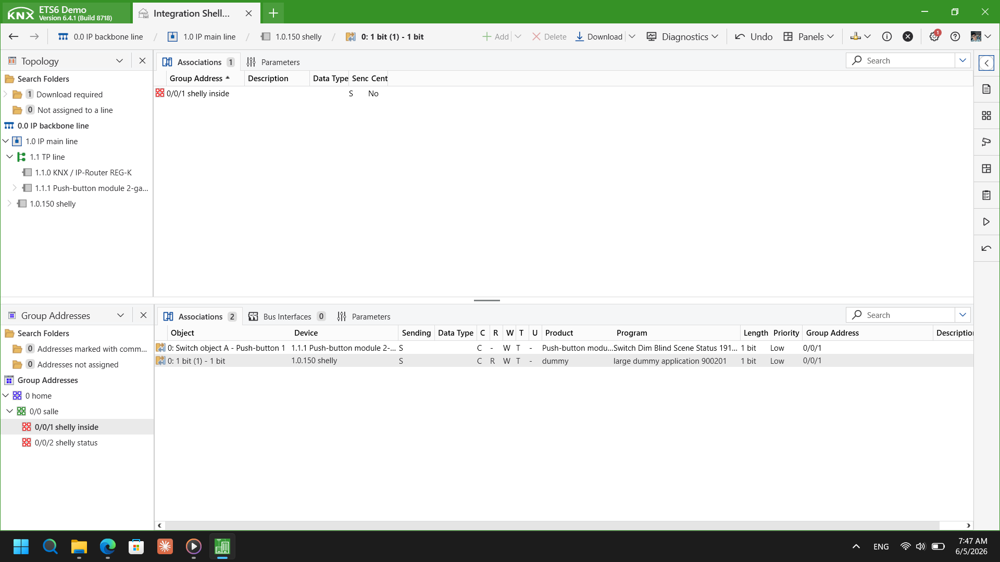

<div align="center">

# 🔌 KNX ↔ Shelly Lamp Control

**Bridging KNX bus infrastructure with modern IoT relay devices**


> A practical KNX-to-Shelly integration for ON/OFF lamp control —  
> built as part of a smart building automation study.

</div>

---

## 📋 Table of Contents

- [Overview](#-overview)
- [System Architecture](#-system-architecture)
- [How It Works](#-how-it-works)
- [Network & Device Map](#-network--device-map)
- [KNX Configuration](#-knx-configuration)
- [Shelly Configuration](#-shelly-configuration)
- [Group Address Map](#-group-address-map)
- [Logic Flow](#-logic-flow)
- [Hardware](#-hardware)
- [Limitations](#-limitations)
- [Future Improvements](#-future-improvements)

---

## 🧭 Overview

This project demonstrates a **KNX bus to Shelly relay integration** for controlling a lamp using a standard KNX push button. The system uses a **KNX IP Interface** to expose KNX telegrams over the local network, which are then interpreted and forwarded as HTTP commands to a **Shelly relay device**.

This pattern is commonly used in **BMS retrofitting** — extending existing KNX installations with low-cost Wi-Fi IoT actuators without replacing the KNX bus wiring or reprogramming ETS from scratch.

**Core use case:**  
`KNX Push Button → KNX IP Interface → Bridge → Shelly Relay → Lamp`

---

## 🏗 System Architecture

```
┌─────────────────────────────────────────────────────────────────────┐
│                          KNX BUS (TP)                               │
│                                                                     │
│   ┌──────────────┐  Telegram    ┌─────────────────────────────┐    │
│   │  KNX Push    │─────────────▶│     KNX IP Interface        │    │
│   │   Button     │  GA: 0/0/1   │     10.0.0.10 : 3671        │    │
│   └──────────────┘  DPT 1.001   └────────────┬────────────────┘    │
│                                              │ KNXnet/IP (UDP)      │
└──────────────────────────────────────────────┼──────────────────────┘
                                               │
                               ┌───────────────▼──────────────┐
                               │        LAN  10.0.0.x          │
                               └───────────────┬──────────────┘
                                               │
                               ┌───────────────▼──────────────┐
                               │     KNX → Shelly Bridge       │
                               │   Listens on GA: 0/0/1        │
                               │   Decodes DPT value (0 / 1)   │
                               └───────────────┬──────────────┘
                                               │
                          ┌────────────────────┼────────────────────┐
                     value = 1             value = 0
                          │                    │
               HTTP GET /relay/0?turn=on   /relay/0?turn=off
                          │                    │
                          └────────────┬───────┘
                                       ▼
                          ┌────────────────────────┐
                          │   Shelly Relay Device   │
                          │   10.0.0.20             │
                          └────────────┬───────────┘
                                       │
                                    ┌──▼──┐
                                    │LAMP │
                                    └─────┘
```

---

## ⚙️ How It Works

1. **User presses** the KNX push button wired on the KNX TP bus.
2. The button sends a **1-bit telegram** (DPT 1.001) to Group Address `0/0/1`.
3. The **KNX IP Interface** (`10.0.0.10:3671`) tunnels the telegram over **KNXnet/IP (UDP)** onto the LAN.
4. The bridge **listens** for telegrams on GA `0/0/1` and decodes the value:
   - `1` → turn ON
   - `0` → turn OFF
5. The bridge sends an **HTTP GET request** to the Shelly relay:
   - `http://10.0.0.20/relay/0?turn=on`
   - `http://10.0.0.20/relay/0?turn=off`
6. The **Shelly relay switches**, powering or cutting the lamp.

---

## 🌐 Network & Device Map

| Device | Role | IP Address | Port / Protocol |
|---|---|---|---|
| KNX IP Interface | KNX bus gateway | `10.0.0.10` | `3671` / KNXnet/IP UDP |
| Shelly Relay | IoT actuator | `10.0.0.20` | `80` / HTTP REST |
| Bridge (host) | Telegram listener + forwarder | `10.0.0.x` | — |

> All devices are on the same `10.0.0.x` LAN subnet. No cloud services required.

---

## 🔧 KNX Configuration

### IP Interface Parameters

| Parameter | Value |
|---|---|
| IP Address | `10.0.0.10` |
| Port | `3671` |
| Connection Type | Tunneling (UDP) |
| Protocol | KNXnet/IP v1.1 |

### ETS6 Software Configuration

The screenshot below shows the ETS6 project configuration used in this integration — including the Group Address `0/0/1` assignment and the associated switching object (DPT 1.001).



> **Group Address `0/0/1`** is linked to the push button switching object.  
> Data Point Type: **DPT 1.001** (1-bit ON/OFF).  
> The Shelly device has **no individual KNX address** — it is integrated at the IP layer only via the bridge.

---

## 📱 Shelly Configuration

### Device Parameters

| Parameter | Value |
|---|---|
| Device IP | `10.0.0.20` |
| Relay Index | `0` (channel 1) |
| API Type | HTTP REST (Gen1) |
| Auth | None (local LAN) |

### HTTP Control Commands

```bash
# Turn lamp ON
curl http://10.0.0.20/relay/0?turn=on

# Turn lamp OFF
curl http://10.0.0.20/relay/0?turn=off

# Read current relay status
curl http://10.0.0.20/relay/0
```

---

## 📍 Group Address Map

| Group Address | Object | DPT | Direction | Description |
|---|---|---|---|---|
| `0/0/1` | Lamp Switch | 1.001 | Send | ON/OFF from KNX push button |
| `0/0/2` | Lamp Feedback | 1.001 | Receive | *(planned)* Shelly status → KNX |

---

## 🔁 Logic Flow

```
KNX Push Button
      │
      │  DPT 1.001 telegram → GA 0/0/1
      ▼
KNX IP Interface (10.0.0.10:3671)
      │
      │  KNXnet/IP UDP tunnel
      ▼
Bridge Listener
      │
      ├── value = 1 ──▶ GET /relay/0?turn=on  ──▶ Shelly 10.0.0.20 ──▶ LAMP ON
      └── value = 0 ──▶ GET /relay/0?turn=off ──▶ Shelly 10.0.0.20 ──▶ LAMP OFF
```

**Wiring note:**  
The Shelly relay is wired **in-line** with the lamp load (Live wire through relay output).  
The KNX push button is wired to the **KNX TP bus** — no direct connection to Shelly.

---

## 📸 Hardware

### KNX Valise (Training Kit)


> KNX TP bus training kit used for this integration — includes push button, IP interface, and bus power supply.

### Shelly Relay Module + Lamp


> Shelly relay wired in-line with the lamp load. The relay receives HTTP commands from the bridge and switches the output accordingly.

---

## ⚠️ Limitations

- **Not a native KNX device** — Shelly does not appear on the KNX bus or in ETS topology
- **No automatic feedback** — Shelly state is not reported back to KNX group objects by default
- **Single group address** — covers one lamp (`GA 0/0/1`) only in current version
- **No retry logic** — if the Shelly HTTP request fails, no fallback is triggered
- **Local network dependency** — no cloud fallback; both devices must be on same LAN
- **No scene or dimming support** — only binary ON/OFF (DPT 1.001)

---

## 🚀 Future Improvements

- [ ] Feedback loop: poll Shelly status → write back to KNX GA `0/0/2`
- [ ] Multi-device support: map multiple GAs to multiple Shelly relays via `config.json`
- [ ] MQTT transport layer (Shelly supports MQTT natively — avoids HTTP polling)
- [ ] Node-RED flow as a no-code visual alternative
- [ ] Docker container for portable, always-on bridge deployment
- [ ] Integration with KNX visualization panels (iRidium, GIRA X1, or custom web dashboard)
- [ ] Error handling + reconnection logic for KNXnet/IP tunneling drops

---

## 📁 Repository Structure

```
knx-shelly-lamp-control/
├── README.md
├── .gitignore
├── src/
│   └── knx_shelly_bridge.js       # Bridge script (listener + HTTP forwarder)
├── config/
│   ├── knx_config_example.json    # KNX IP Interface config
│   └── shelly_config_example.json # Shelly device + GA mapping
├── docs/
│   ├── architecture.md
│   ├── knx_setup.md
│   └── shelly_setup.md
└── images/
    ├── ets6.png
    ├── knx_valise.jpg
    └── shelly_module_nd_light.jpg
```

---

## 👤 Author

**Abdelkhalek Mammeri**  
Electronics Engineer | IoT & Smart Systems Developer

[](https://github.com/Ab40D)
[](https://se7en-web.vercel.app/)
